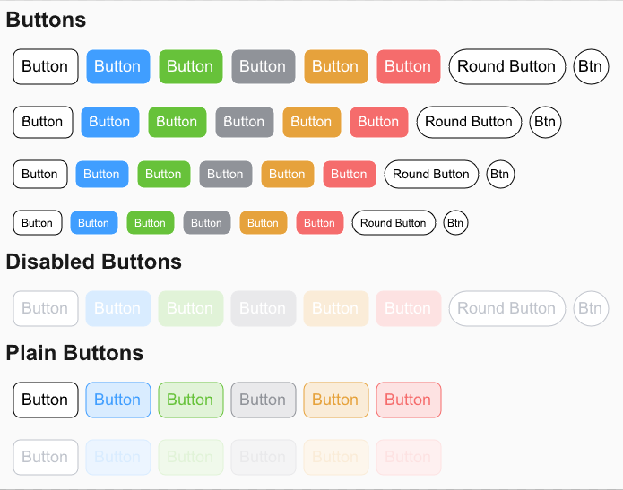
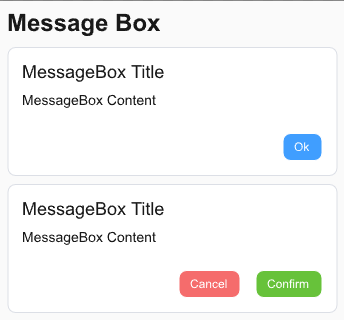
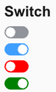

# Slint UI Component Library

>

Color scheme from element UI

## Description

    UI component library based on the slint framework

### Button Example



#### Attributes

| Attribute | Description         | type        | Default | Accepted values                             |
|-----------|---------------------|-------------|---------|---------------------------------------------|
| size      | size                | ButtonSize  | Default | Default,Medium ,Small ,Mini                 |
| type      | Preset color        | ButtonType  | Default | Default,Primary,Success,Info,Warning,Danger |
| round     | Round corner        | ButtonRound | Default | Default,Round,Circle                        |
| disabled  | Is it disabled      | bool        | false   |                                             |
| plain     | Is it plain         | bool        | false   |                                             |
| text      | Button display text | string      |         |                                             |
| icon      | Button display icon | @image-url  |         |                                             |

#### Example Code

```slint
component example{
    Button {
        text: "Button";
        size: ButtonSize.Default;
        type: ButtonType.Default;
        plain: false;
        disabled: false;
        clicked => {}
    }
}
```

### Message Box Example



#### Attributes

| Attribute           | Description               | type   | Default | Accepted values |
|---------------------|---------------------------|--------|---------|-----------------|
| title               | head title                | string |         |                 |
| message             | body content              | string |         |                 |
| confirm-button-text | Confirm button text       | string | Confirm |                 |
| show-cancel-button  | Display the cancel button | bool   | false   |                 |
| cancel-button-text  | Cancel button text        | string | Cancel  |                 |

#### Example Code

```slint
component example{
        MessageBox {
            title: "MessageBox Title";
            message: "MessageBox Content";
            confirm-button-text: "Ok";
            confirm-clicked => {
                debug("confirm clicked");
            }
        }

        MessageBox {
            title: "MessageBox Title";
            message: "MessageBox Content";
            show-cancel-button: true;
            confirm-button-type: ButtonType.Success;
            cancel-button-type: ButtonType.Danger;
            confirm-clicked => {
                debug("confirm clicked");
            }
            cancel-clicked => {
                debug("cancel clicked")
            }
        }
}
```

### Switch Example



#### Attributes

| Attribute      | Description    | type  | Default | Accepted values |
|----------------|----------------|-------|---------|-----------------|
| active         | active status  | bool  | true    |                 |
| inactive-color | inactive color | color |         |                 |
| active-color   | active color   | color |         |                 |

#### Example Code

```slint
component example{
        Switch {
            width: 40px;
            height: 20px;
        }
}
```