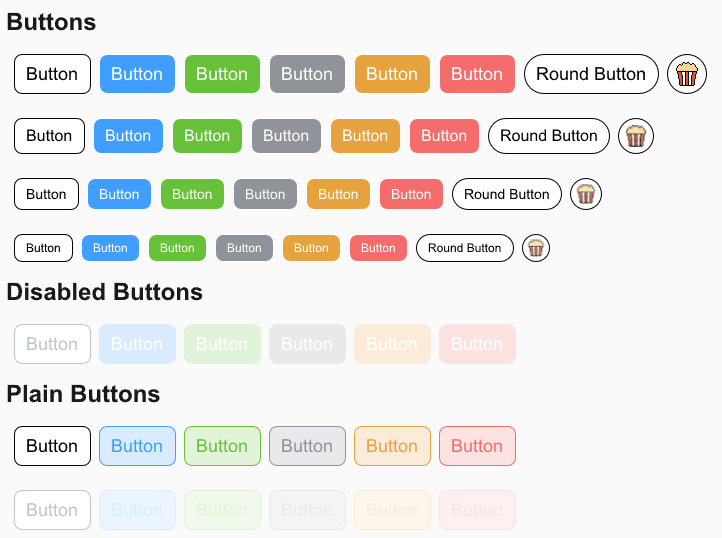

# Slint UI Component Library
>

Color scheme from element UI

### Buttons



#### Attributes

| Attribute | Description | type        | Default | Accepted values                             |
|-----------|-------------|-------------|---------|---------------------------------------------|
| size      | button size | ButtonSize  | Default | Default,Medium ,Small ,Mini                 |
| type      | button size | ButtonType  | Default | Default,Primary,Success,Info,Warning,Danger |
| round     | button size | ButtonRound | Default | Default,Round,Circle                        |
| disabled  | button size | bool        | false   |                                             |
| plain     | button size | bool        | false   |                                             |

```slint
component example{
    Button {
        size: ButtonSize.Default;
        type: ButtonType.Default;
        plain: false;
        disabled: false;
        clicked => {}
    }
}
```